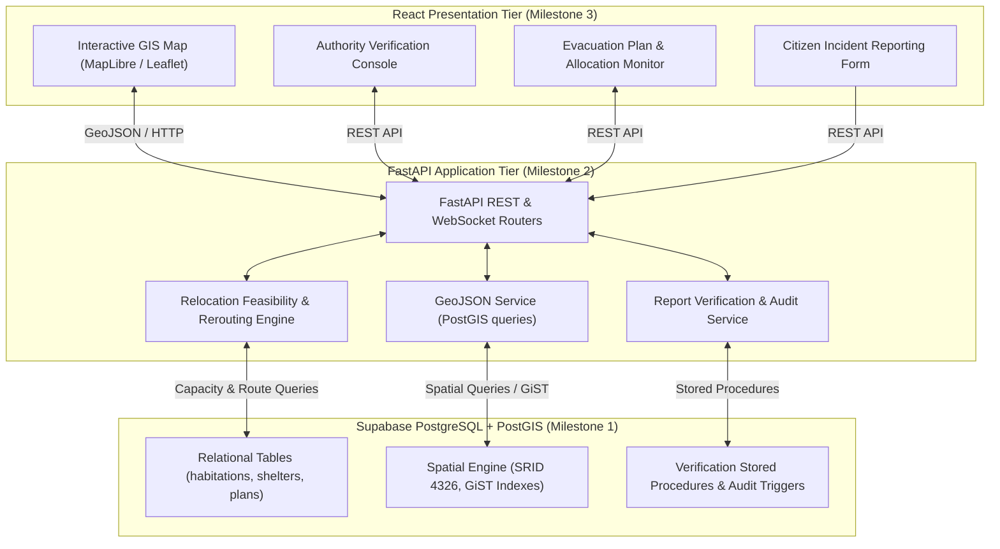

# SafeSettle MVP — Architecture & System Design
**Smart India Hackathon (SIH 2026) — Disaster-Relocation Decision-Support MVP**

---

## 1. System Mission & Context

During extreme climatic events (cyclones, monsoon flash-flooding, storm surges, landslides), disaster management authorities face severe cognitive overload when coordinating population evacuations. Critical failure points include:
1. Allocating populations to shelters without real-time knowledge of road washouts or bridge collapses.
2. Shelter overcrowding caused by lack of coordinated capacity monitoring.
3. Unverified citizen panic reports interfering with official operational response.

**SafeSettle** is an intelligent, geospatial decision-support platform designed to bridge crowdsourced hazard reports and official evacuation coordination. It enforces rigorous verification of ground incidents before altering operational models, computes capacity-feasible habitation-to-shelter assignments, and adapts routes dynamically when transit corridors are compromised.

---

## 2. Multi-Tier Architecture Overview



---

## 3. Technology Stack

| Layer | Technology | Rationale |
| :--- | :--- | :--- |
| **Database** | PostgreSQL 15+ & PostGIS (via Supabase) | Native spatial primitives (`Point`, `LineString`, `MultiPolygon`), `ST_` spatial functions, ACID compliance, real-time replication. |
| **Backend** | Python 3.12+ with FastAPI | Asynchronous high performance, native Pydantic data validation, seamless GeoJSON serialization, scientific/graph algorithms. |
| **Frontend** | React with TypeScript & Tailwind CSS | Responsive component architecture, MapLibre GL / Leaflet integration for high frame-rate vector rendering. |
| **Security** | Supabase Auth + Row-Level Security (RLS) | Role-Based Access Control (Admin, Disaster Officer, Field Responder, Citizen). |

---

## 4. Disaster Lifecycle Flow

```mermaid
sequenceDiagram
    autonumber
    actor Citizen as Citizen / Field Observer
    participant API as FastAPI Backend
    participant DB as PostgreSQL + PostGIS
    actor Officer as Disaster Management Officer
    participant Engine as Decision Support Engine

    Citizen->>API: Submit incident (Road Flooded / Debris Blockage)
    API->>DB: INSERT INTO citizen_reports (status='PENDING_VERIFICATION')
    Note over DB: Operational tables (roads/shelters) remain unchanged!

    Officer->>API: Query pending incident queue
    API->>DB: SELECT * FROM citizen_reports WHERE status='PENDING_VERIFICATION'
    Officer->>API: Submit verification (Decision='VERIFIED', Notes)
    API->>DB: CALL verify_citizen_report(...)
    
    Officer->>API: Confirm GIS operational update (Road status='FLOODED')
    API->>DB: CALL apply_verified_report_to_gis(...)
    
    API->>Engine: Trigger plan feasibility recheck
    Engine->>DB: SELECT * FROM v_plan_assignment_health / recheck_plan_feasibility(...)
    DB-->>Engine: Returns compromised assignments
    Engine-->>Officer: Alert: 1 route blocked; alternative shelter suggested
```

---

## 5. Milestone Delivery Roadmap

- **Milestone 1 (Current)**: Supabase + PostGIS Database Foundation. Clean project structure, spatial schema, migration scripts, verification workflow, seed dataset, and security guidelines.
- **Milestone 2**: FastAPI Backend Foundation. Asynchronous database connectivity, GeoJSON endpoints, report verification lifecycle handlers, and spatial queries.
- **Milestone 3**: React Frontend & Interactive Geospatial Dashboard. Authority console, citizen reporting modal, MapLibre visualization.
- **Milestone 4**: Relocation Optimization Engine & Dynamic Rerouting. Capacity-aware allocation solver, disrupted corridor reassignment.
- **Milestone 5**: Full Integration, User Acceptance Testing, and Deployment.
