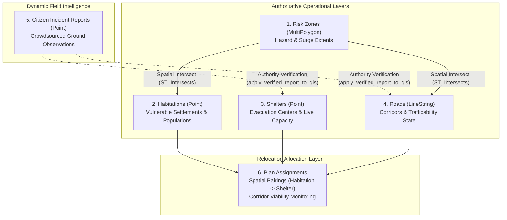

# SafeSettle MVP — Milestone 2: GIS Data Plan
**Pilot Scenario: Coastal Cyclone and Flood Evacuation (Puri, Odisha, India)**

---

## 1. Executive Summary & Objective

The objective of Milestone 2 is to formalize the geospatial foundation for the SafeSettle decision-support prototype. Building upon the PostgreSQL + PostGIS database deployed in Milestone 1, this document specifies the pilot area geography, coordinate system standards, layer models, spatial relationships, prototype data boundaries, external integration paths, and PostGIS analytical query strategies.

---

## 2. Pilot Geographic Scope

### 2.1 Focus Region
- **Location:** Puri District Coastal Corridor, Odisha, Eastern India.
- **Topographic Context:** Low-lying deltaic coastal plain along the Bay of Bengal, characterized by riverine networks (Bhargavi and Kushabhadra tributaries) and estuarine surge zones vulnerable to extreme North Indian Ocean cyclonic landfalls.
- **Geographic Extent (Bounding Box):**
  - **West Longitude:** 85.70° E
  - **East Longitude:** 85.90° E
  - **South Latitude:** 19.75° N
  - **North Latitude:** 19.95° N
- **Key Operational Nodes Represented:**
  - *Coastline & Vulnerable Settlements:* Balukhanda Coastal Hamlet, Pentakota Fishermen Colony.
  - *Inland & Lowland Basti:* Chandanpur Riverine Basti, Satyabadi Agrarian Settlement.
  - *Elevated Shelters:* Gop Multipurpose Cyclone Shelter (elevated inland campus), District Higher Secondary School Shelter Complex, Satyabadi Community Resilience Center.
  - *Key Corridors:* NH-316 Coastal Arterial Route, Chandanpur-Gop Rural Relief Link, Pentakota Shoreline Access Road, Satyabadi Bypass Connector.

---

## 3. Spatial Reference System Standard

### 3.1 EPSG:4326 (WGS 84)
- All geometry columns in SafeSettle (`habitations`, `shelters`, `roads`, `risk_zones`, `citizen_reports`) strictly enforce **SRID 4326**.
- **Coordinate Order:** Stored natively as `(Longitude, Latitude)`:
  - Longitude ($X$): East-West displacement (approx. 85.70 to 85.90 for the pilot area).
  - Latitude ($Y$): North-South displacement (approx. 19.75 to 19.95 for the pilot area).
- **Web Mapping Compatibility:**
  - Web client mapping platforms (MapLibre GL, Mapbox GL, Leaflet, OpenLayers) natively consume GeoJSON features defined in EPSG:4326 coordinates and project them to Web Mercator (EPSG:3857) on the fly.
  - Using SRID 4326 at the database layer avoids projection mismatch errors between client GeoJSON ingestion and database storage.

### 3.2 Geodetic Proximity via PostGIS Geography Casting
- Angular degrees in EPSG:4326 vary in ground distance by latitude.
- When computing metric distances (e.g. kilometers from a settlement to a shelter, or buffer radiuses for blocked roads), queries cast geometries to PostGIS `geography` (`geom::geography`).
- This calculates true Great-Circle / ellipsoidal distances on the WGS 84 spheroid in meters without requiring projected planar conversions.

---

## 4. Geospatial Data Layer Model

SafeSettle structures its GIS intelligence into five primary layers:

### 4.1 Layer 1: Risk Zones (`risk_zones`)
- **Geometry:** `MultiPolygon` (SRID 4326).
- **Domain:** Hazard footprints representing coastal cyclone storm surge inundation, river embankment breach zones, and flash-flood catchment areas.
- **Attributes:** `name`, `hazard_type` (`FLOOD`, `STORM_SURGE`, `CYCLONE`, etc.), `risk_level` (`LOW`, `MEDIUM`, `HIGH`, `CRITICAL`).
- **Operational Role:** Identifies settlements requiring mandatory evacuation orders and isolates transit corridors submerged by water.

### 4.2 Layer 2: Habitations (`habitations`)
- **Geometry:** `Point` (SRID 4326, settlement centroid).
- **Domain:** Villages, hamlets, bastis, and wards at risk.
- **Attributes:** `name`, `population`, `vulnerable_population` (elderly, disabled, infants), `risk_level`, `priority_score` (computed urgency metric).
- **Operational Role:** Represents the demand side of the evacuation equation.

### 4.3 Layer 3: Shelters (`shelters`)
- **Geometry:** `Point` (SRID 4326, facility coordinate).
- **Domain:** Permanent cyclone shelters, elevated educational institutions, and community resilience complexes.
- **Attributes:** `name`, `physical_capacity`, `current_occupancy`, `functional_available_capacity`, utility flags (`water_available`, `sanitation_available`, `medical_support`, `transport_available`), `status` (`ACTIVE`, `INACTIVE`, `FULL`, `DAMAGED`).
- **Operational Role:** Represents the supply/intake side of the evacuation equation.

### 4.4 Layer 4: Evacuation Roads (`roads`)
- **Geometry:** `LineString` (SRID 4326, road centerlines).
- **Domain:** Highways, arterial corridors, and secondary rural access links.
- **Attributes:** `name`, `status` (`CLEAR`, `CONGESTED`, `FLOODED`, `BLOCKED`, `DAMAGED`), `road_type` (`HIGHWAY`, `PRIMARY`, `SECONDARY`, `TERTIARY`, `TRACK`, `BRIDGE`).
- **Operational Role:** Graph infrastructure connecting habitations to shelters.

### 4.5 Layer 5: Citizen Incident Reports (`citizen_reports`)
- **Geometry:** `Point` (SRID 4326, field report coordinates).
- **Domain:** Crowdsourced hazard observations (waterlogging, fallen trees, bridge collapse).
- **Attributes:** `report_type`, `description`, `severity`, `status` (`PENDING_VERIFICATION`, `VERIFIED`, `REJECTED`), `verified_at`, `verified_by`, `verification_notes`.
- **Operational Role:** Real-time situational awareness feed isolated from operational tables until verified.

---

## 5. Relocation Plan Geographic Relationships

The link between operational geography and emergency planning is established via `relocation_plans` and `plan_assignments`:

1. **Spatial Pairings:** Each `plan_assignment` records an evacuation route linking a source `habitation` centroid to a destination `shelter` facility.
2. **Path Distance:** Tracked in `route_distance` (kilometers).
3. **Corridor Health:** Monitored dynamically via `route_status` (`OPTIMAL`, `VIABLE`, `COMPROMISED`, `BLOCKED`, `NEEDS_REASSIGNMENT`).
4. **Feasibility Coupling:**
   - If a verified citizen report leads to a road marked `BLOCKED` or a shelter marked `DAMAGED` / `FULL`, the view `v_plan_assignment_health` immediately surfaces the affected assignments.
   - The stored procedure `recheck_plan_feasibility(plan_id)` automatically updates the plan status to `FEASIBILITY_CHECK_FAILED` and records the compromised assignment count.

---

## 6. Prototype Dataset Boundaries & Disclaimer

> [!IMPORTANT]
> **Prototype Demonstration Notice:**
> The data seeded in Milestone 1 (`003_seed_data.sql`) represents a **synthetic pilot evacuation scenario** based on real geographical landmarks in the Puri-Bhubaneswar corridor of Odisha, India.
> - Population counts, shelter occupancies, hazard boundaries, road statuses, and citizen incident reports are designed specifically for software demonstration, testing, and algorithmic evaluation.
> - **They are NOT official Government of Odisha, OSDMA, or NDMA operational records.**
> - Prototype systems using this dataset must clearly display demo notices in presentation interfaces.

---

## 7. Future Authoritative Data Source Integrations

In operational production deployments, the prototype seed data can be augmented or replaced with official and live remote-sensing feeds:

| Source Entity | Potential Data Provider | Integration Method | Refresh Frequency |
| :--- | :--- | :--- | :--- |
| **Road Network** | OpenStreetMap (OSM / Overpass API) / State PWD | OSM Overpass API / GeoJSON pipeline | Weekly or static base layer |
| **Hazard Extents** | ISRO Bhuvan / Copernicus Sentinel-1 SAR | GeoTIFF raster polygonization into PostGIS | Near-real-time (post-landfall) |
| **Cyclone Tracking** | India Meteorological Department (IMD) | IMD Cyclone Bulletin API / RSS GeoJSON | 3 to 6-hour cycles |
| **Shelter Registries** | Odisha State Disaster Management Authority (OSDMA) | State Disaster Registry database sync | Seasonal pre-monsoon update |
| **Settlement Boundaries** | Survey of India (SoI) / Census of India | National spatial database GIS shapefiles | Census cycle / decennial |
| **River Levels** | Central Water Commission (CWC) | CWC telemetry sensor API | Hourly telemetry |

---

## 8. PostGIS Spatial Operations Strategy

PostGIS serves as the primary geospatial computation engine for SafeSettle. Key operational operations include:

1. **Hazard Exposure Filtering (`ST_Intersects`)**:
   Pinpoint habitations and road segments overlapping critical hazard polygons without client-side spatial libraries.
2. **Proximity & Candidate Shelter Discovery (`ST_Distance` on Geography)**:
   Calculate true ellipsoidal ground distance in kilometers to identify the closest shelters with available functional capacity.
3. **Corridor Danger Buffering (`ST_DWithin` on Geography)**:
   Identify all road corridors within a safety buffer (e.g. 100 meters) of verified hazard reports.
4. **Sub-millisecond Spatial Indexing (`GiST`)**:
   Every spatial column utilizes Generalized Search Trees on bounding boxes, ensuring that spatial queries remain scalable as dataset sizes increase.
5. **Direct GeoJSON Export (`ST_AsGeoJSON`)**:
   Database-level serialization converts spatial rows directly into RFC 7946 GeoJSON format, minimizing serialization overhead in the FastAPI backend.
